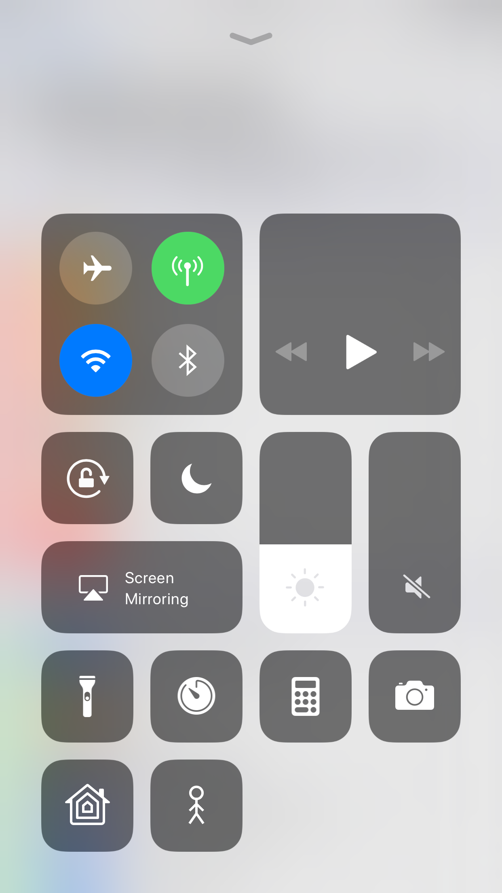
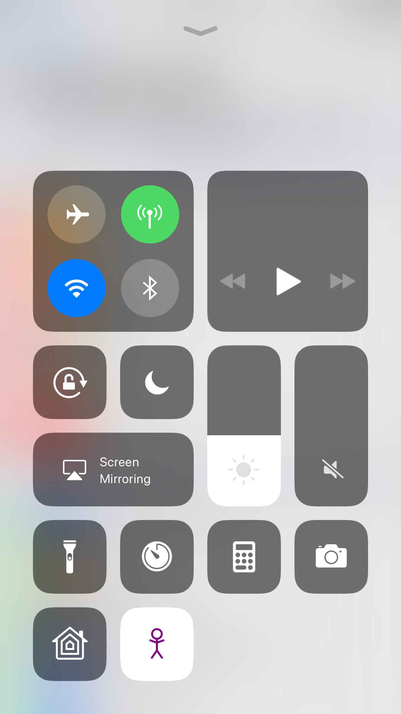
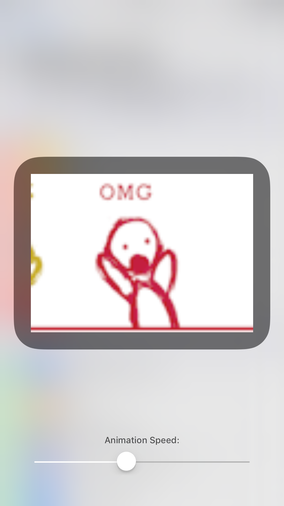

#  TestCustomUIModule

This module provides a more customised experience than the other modules. The button glyph is set to a CAML package (CoreAnimation Markup Language) instead of a simple image, which lets it be a bit more dynamic. A completely custom UI is shown when the button is expanded.

The button can be selected by tapping and expanded by 3D Touching.

-----

