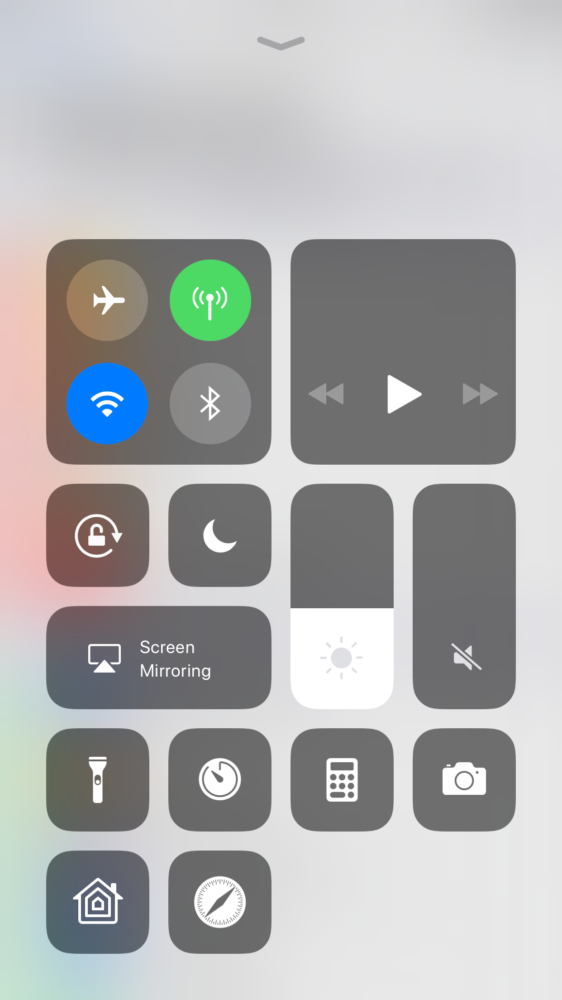
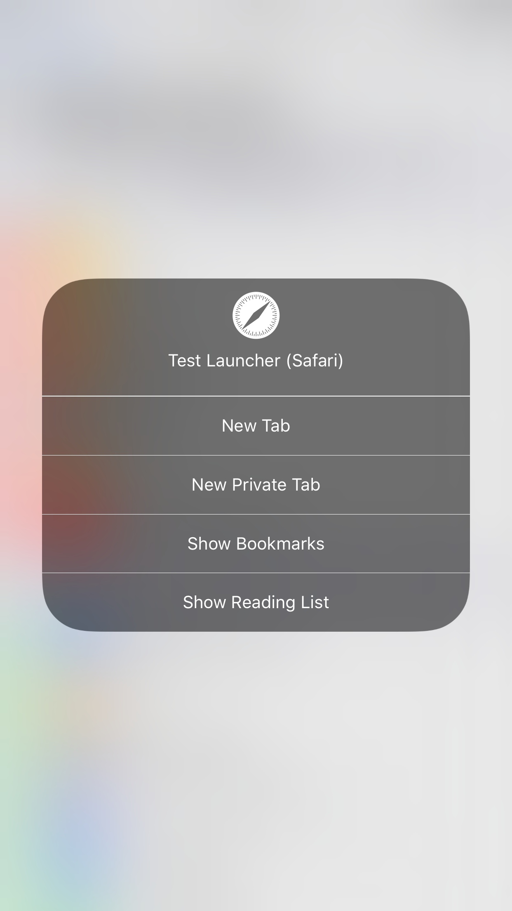

# TestLauncherModule
-----

A launcher module provides a shortcut to an application.
`CCUIAppLauncherModule` (from `ControlCenterUIKit`) provides all of the functionality needed by a simple launcher module, so it's possible to make one without writing any code (such as this one).

The default behaviour is to provide a button that launches the associated app when tapped.
Expanding the button (via 3D Touch) provides a menu populated with the app's [shortcut items](https://developer.apple.com/documentation/uikit/uiapplicationshortcutitem).

Appearance customisation:
Bundle Image | Type | Description
-----------------|-------|--------------
AppIcon | Template | This is used as the glyph for the button in control centre. Its also used in the header of the menu shown when the button is expanded.

Behaviour customisation:
Info.plist Key | Description
----------------|--------------
CCAssociatedBundleIdentifier | Bundle ID for the app associated with the launcher.
CCLaunchURL *(optional)* | If given, pressing the button will open this URL instead of launching the app. This is useful for modules such as the stopwatch module that need to open a specific page within an app.

-----

